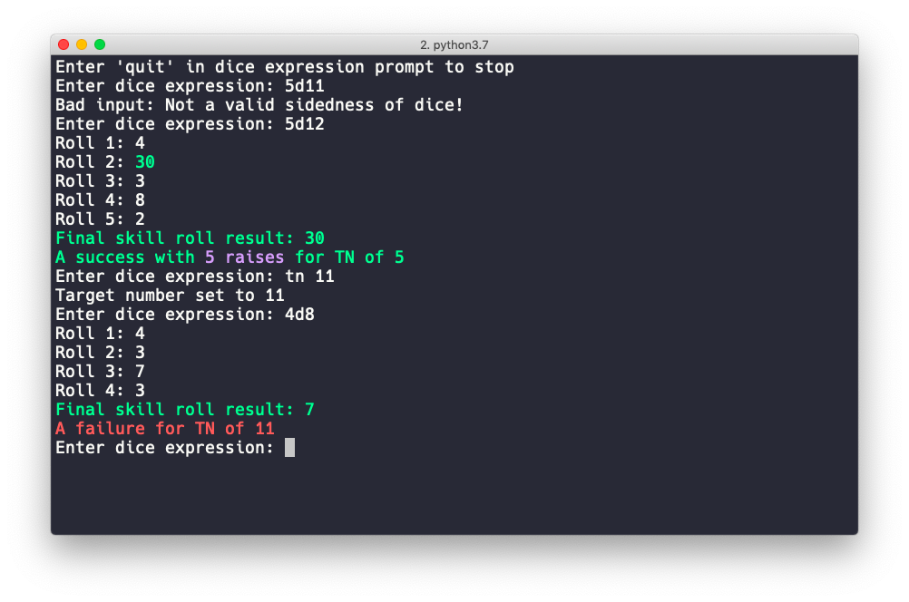

# Deadlands Dice Roller

A simple textual roller of dice pools for a Deadlands Classic skill check.
A Deadlands Classic skill check involves 'exploding' dice ('aces' in Deadlands
terms) and the selection of only the single highest roll (or series of exploded
rolls) from a given pool, with critical failures ('busts') on a majority of 1s.

## Current Status

Ultra early pre alpha, heavily WIP. Not ready at all.

## Usage

Pass the argument '--halfbust' to switch bust mechanics to nonmajority 50% of
dice in the pool rolling a 1.

Type in the skill roll desired in the normal format of, eg, '3d8'

To change the target number, use 'tn' followed by the new number. Whitespace before
the new number is optional. Correctly setting the target number for your situation
allows automatic determination of failure or success, and the number of raises,
if any.

Type 'quit' to exit the program

